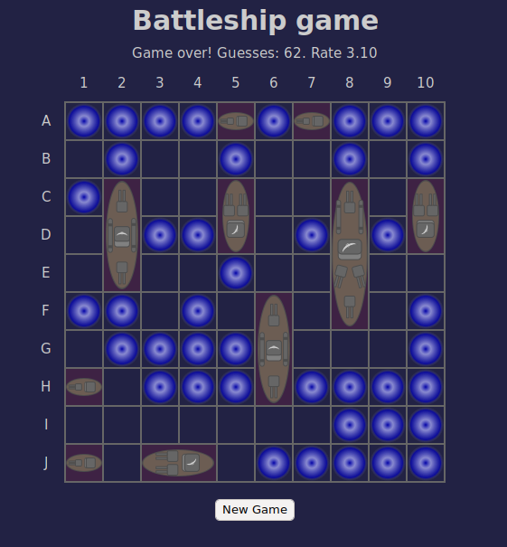

# Battleship game

Simple one-way game, written in Javascript.
Ships are generating in random location.
Classic rule placement: ship can't be connected by any side or corner.
Count guesses, rate.
Some configuration in the model object: cell size, number of rows/columns, ships.
